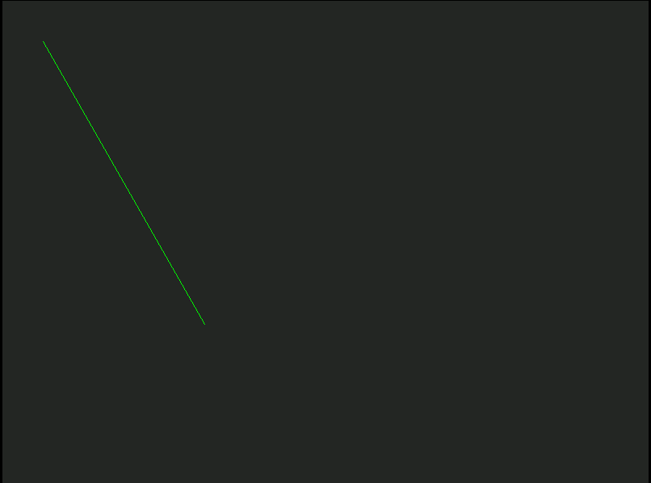
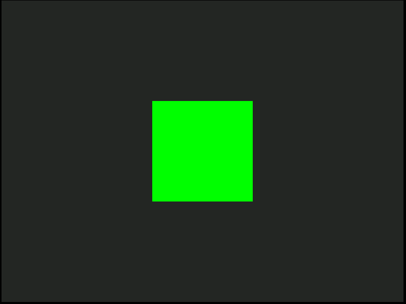
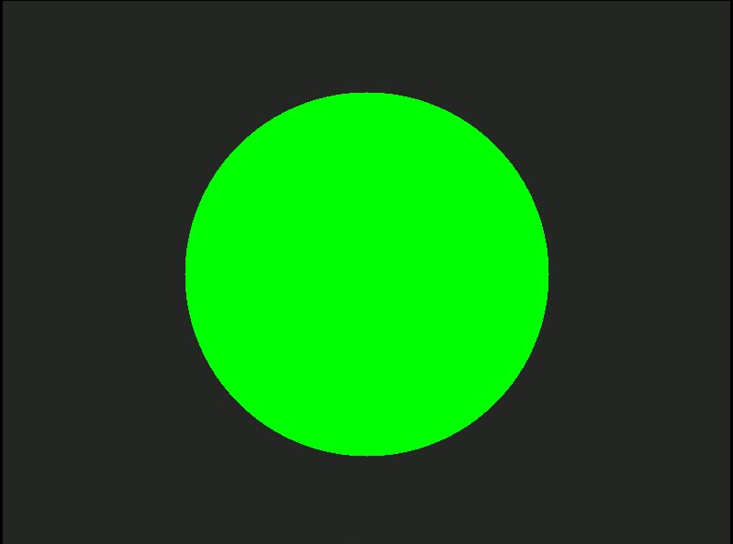
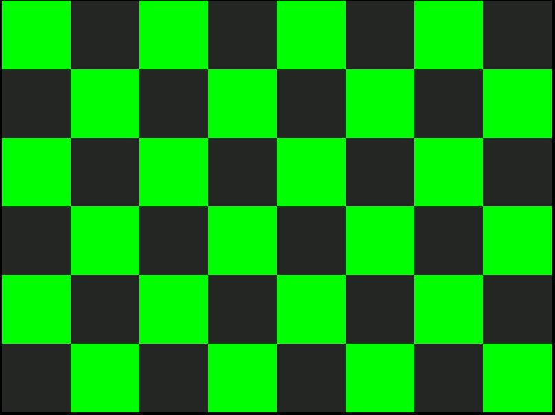

# Rose Graphics

This a simple and naive implementation a low level graphics library in C.

I'm building this just to help me understand the fundamentals graphics primitives and U know that i don't have to tell to NOT use this in real world projects.

## Screenshots

1. [Draw line](./examples/draw_line.c) [(Bresenham's line algorithm)]()

3. [Fill Rect](./examples/fill_rect.c)

3. [Fill circle](./examples/fill_circle.c)

4. Checker pattern

